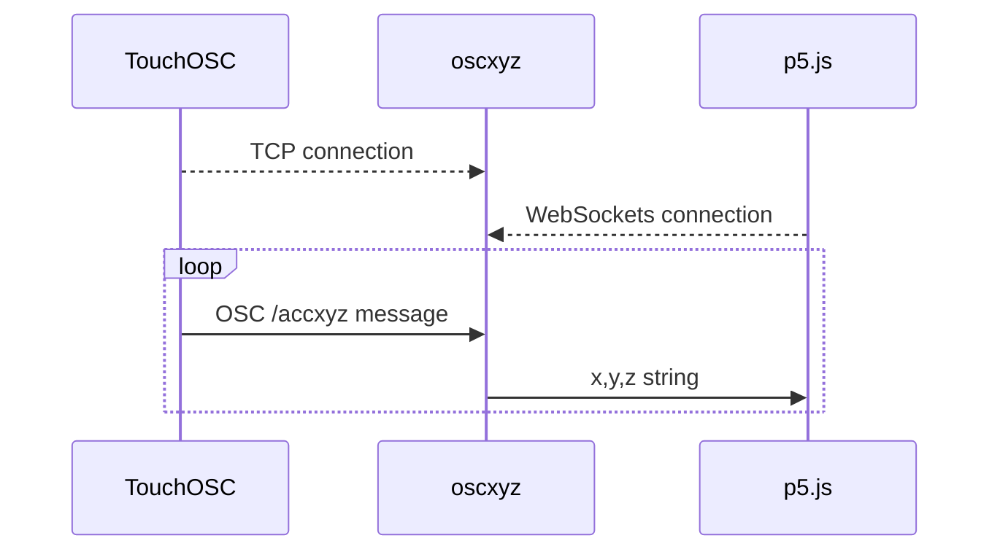

# TouchOSC Accelerometer Data to p5js

## Description

oscxyz is a simple OSC-to-WebSockets bridge that takes OSC messages from a client, like [TouchOSC](https://hexler.net/touchosc), and sends them to a WebSocket client, like a p5js sketch.

Note that this implementation is very basic and was created specifically to handle accelerometer data with an OSC type tag of ",fff" and an address pattern of "/accxyz" (although the address pattern can be changed with the --pattern flag).

## Sequence Diagram



## Installation

1. Download the appropriate archive file from the [Releases](releases) page.
2. Place the `oscxyz` executable somewhere in your path
3. Run it from a terminal window as described below. On MacOS, use the Terminal app. On Windows, you might need to [download Windows Terminal](https://apps.microsoft.com/store/detail/windows-terminal/9N0DX20HK701?hl=en-us&gl=us&rtc=1) from Microsoft.

## Usage

### On Your Computer

Open a terminal window and run the command using the following syntax:

```console
Usage:
  oscxyz [flags]

Flags:
  -h, --help             help for oscxyz
      --oschost string   IP address to use when creating the OSC server (required)
      --oscport int      Port number to use when creating the OSC server (required)
      --pattern string   OSC message pattern to listen for (default "/accxyz")
  -q, --quiet            Don't show OSC messages on the console
  -v, --values           Only send the values of the OSC message
      --wsport int       Port number to use when creating the WebSockets server (required)
```

For example:

```console
oscxyz -oschost=192.168.4.20 --oscport=8000 --wsport=8080 --values
```

### On Your Phone

1. Start TouchOSC
2. In Settings, touch "OSC" and enter the host IP address and port (outgoing) using the values you typed in the terminal
3. Also in Settings, touch "Options" and turn on "Accelerometer (/accxyz)"

You should start seeing the accelerometer OSC messages appear in the terminal window where oscxyz is running (unless you used the `--quiet` flag).

## Examples

Look at this [separate repo](https://github.com/rahji/oscxyz_clientdemos) for some p5.js examples.

## Issues

* This currently only works with TouchOSC, I think. This is because it's the only phone app that I've seen that includes all three axes in one OSC message. I will update this tool to work with other apps (like [MultiSense Osc](https://play.google.com/store/apps/details?id=edu.polytechnique.multisense.release&hl=en_US&gl=US)), but I'm hesitant to go too far since I intend to make a more comprehensive OSC tool with many more options - probably this summer.
* oscxyz doesn't handle OSC bundles - only messages.
