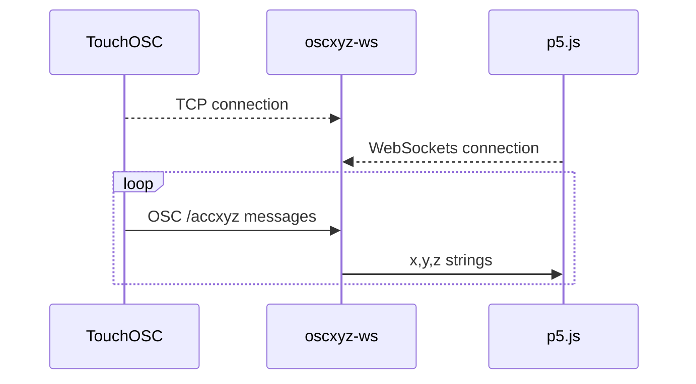

# TouchOSC Accelerometer Data to p5js

*Note that this README matches the initial commit, which doesn't do anything with WebSockets yet.*

## Description

oscxyz is a simple OSC-to-WebSockets bridge that takes OSC messages from a client, like [TouchOSC](https://hexler.net/touchosc), and sends them to a WebSocket client, like a p5js sketch.

Note that this implementation is very basic and was created specifically to handle accelerometer data with an OSC type tag of ",fff" and an address pattern of "/accxyz" (although the address pattern can be changed with the --pattern flag).

## Sequence Diagram



## Usage

### On Your Computer

Open a terminal window and run the command using the following syntax:

```console
Usage:
  oscxyz [flags]

Flags:
  -h, --help             help for oscxyz
      --oschost string   IP address to use when creating the OSC server (required)
      --oscport int      Port number to use when creating the OSC server (required)
      --pattern string   OSC message pattern to listen for (default "/accxyz")
  -q, --quiet            Don't show OSC messages on the console  
      --wsport int       Port number to use when creating the WebSockets server (required)
```

For example:

```console
oscxyz -oschost=192.168.4.20 --oscport=8000 --wsport=8080
```

### On Your Phone

1. Start TouchOSC
2. In Settings, touch "OSC" and enter the host IP address and port (outgoing) using the values you typed in the terminal
3. Also in Settings, touch "Options" and turn on "Accelerometer (/accxyz)"

You should start seeing the accelerometer OSC messages appear in the terminal window where oscxyz is running.
